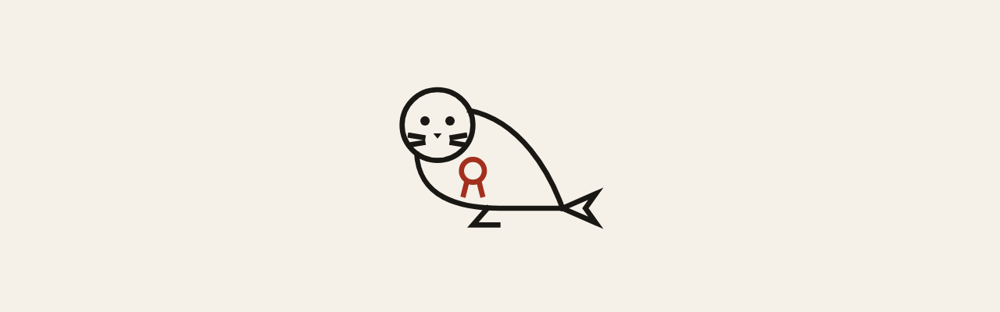

<p align="center"></p>

# trueseal-docs

Documentation and landing site for the [TrueSeal](https://github.com/buenomini/TrueSeal) E2EE sync ecosystem. Built with Astro 5 + React islands, deployed on Cloudflare Pages.

---

## Setup

Requires [Bun](https://bun.sh).

```bash
cd docs
bun install
```

## Development

```bash
bun run dev
```

Opens at `http://localhost:4321`. Telemetry is disabled by default.

## Build

```bash
bun run build
```

Output goes to `dist/`. Static site, no adapter needed.

## Check

```bash
bun run check
```

Type-checks with `astro check`, builds, then runs `bun test`. Some tests read the built site in `dist/`, so run `bun run build` before running `bun test` on its own.

To screenshot built pages in both themes at desktop and phone width (run `bunx playwright install chromium` once first):

```bash
bun run screenshot /tmp/shots / /docs/introduction
```

The mascot artwork is `brand/mascot/mascot.svg`. After changing it, run `bun run export-mascot` to regenerate the PNG exports beside it.

---

## Deployment

This repo is connected to **Cloudflare Pages**. Any push to `main` triggers an automatic build and deploy. No manual steps required.

Build settings (already configured in Cloudflare):
- **Framework**: Astro
- **Build command**: `bun run build`
- **Output directory**: `dist`

---

## Content

Documentation lives in `src/content/docs/`. Files can be `.md` or `.mdx`.

Use `.mdx` when a page needs custom components (flow diagrams, phase breakdowns, code blocks with tabs, callouts, etc.). Plain prose pages can stay as `.md`.

### Kitchen Sink

`/docs/kitchen-sink` is the component reference page — every available MDX component rendered in one place. Check it before writing new doc pages to see what's available.

| Component | Usage |
|---|---|
| `<Callout variant="note|tip|warning|danger">` | Info boxes |
| `<CodeBlock lang="..." code={...} />` | Single-language code block with copy button |
| `<CodeBlock tabs={[{lang, code}]} />` | Multi-language tabbed code block |
| `<PhaseStack phases={[...]} />` | Numbered phase breakdown with optional code/checklist per phase |
| `<FlowDiagram left center right />` | 3-panel node flow diagram (device → relay → device); each step is `{ label }` |
| `<NextPage href label />` | Bottom page navigation |

---

## Project Structure

```
brand/
  mascot/         # Mascot SVG and its PNG exports
src/
  components/
    landing/      # Landing page sections
    docs/         # Sidebar
    layout/       # Navbar, Wordmark, Footer
    mdx/          # Reusable MDX components
    ui/           # Buttons, badges, theme toggle, mascot
  config/         # nav.ts (sidebar), site.ts (version label)
  content/
    docs/         # All documentation markdown
  layouts/        # BaseLayout, DocsLayout, LandingLayout
  pages/          # Astro routes
  styles/         # tokens.css, global.css
```

`tests/` holds the brand checks on the source and the Landing checks and the mascot and 404 checks on the built site, run by `bun test`.
